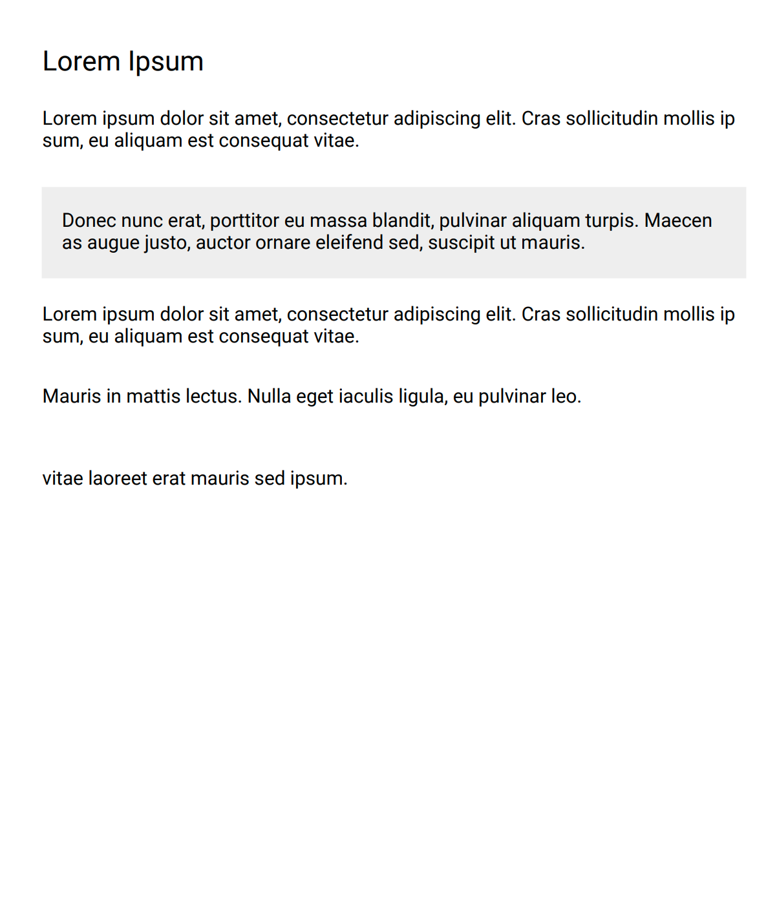
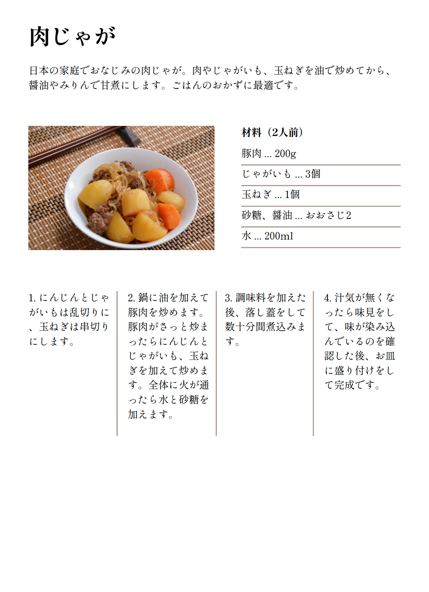
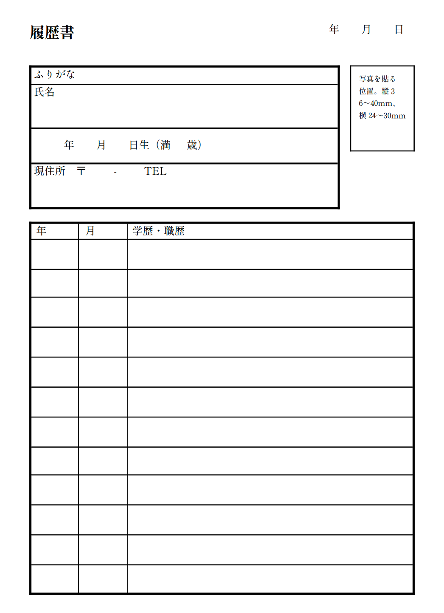

# markup-pdf-rs

The Rust library for making a PDF files by writing kind of like HTML and CSS.
Inspired by [Satori](https://github.com/vercel/satori) and [React-pdf](https://github.com/diegomura/react-pdf). 
This library makes a PDF file with [taffy](https://github.com/DioxusLabs/taffy) and [printpdf](https://github.com/fschutt/printpdf).

> :warning: This library is a prototype so we don't recommend using it in production.

## Usage

```rust main.rs
use std::{
    fs::{File},
    io::BufWriter,
};

use markup_pdf_rs::{assets::Assets, document::Document, dom, style::Style};
use taffy::{
    prelude::{Rect, Size},
    style::{
        Dimension::{self, Points},
        FlexDirection, JustifyContent,
    },
};

fn main() {
    // Define styles like CSS used by XML.
    let mut assets = Assets::default();
    assets.styles.add(
        // Specify the name of the style
        // You can use this style by setting the `style` attribute to an element
        // e.g. `<Layer style="page" />`
        "page",
        Style {
            // These styles are basically the same as taffy.
            size: Size {
                width: Points(210.0),
                height: Points(297.0),
            },
            ..Style::DEFAULT
        },
    );
    assets.styles.add(
        "main",
        Style {
            gap: Size {
                width: Dimension::Auto,
                height: Points(6.0),
            },
            flex_grow: 1.0,
            flex_direction: FlexDirection::Column,
            justify_content: JustifyContent::FlexStart,
            padding: Rect::from_points(15.0, 15.0, 15.0, 15.0),
            ..Style::DEFAULT
        },
    );
    assets.styles.add(
        "title",
        Style {
            font_size: 20.0,
            size: Size {
                width: Dimension::Auto,
                height: Points(10.0),
            },
            ..Style::DEFAULT
        },
    );
    assets.styles.add(
        "paragraph",
        Style {
            size: Size {
                width: Dimension::Auto,
                height: Points(15.0),
            },
            ..Style::DEFAULT
        },
    );
    assets.styles.add(
        "blockquote",
        Style {
            background_color: Some("#eeeeee"),
            size: Size {
                width: Dimension::Auto,
                height: Points(23.0),
            },
            ..Style::DEFAULT
        },
    );
    assets.styles.add(
        "blockquote-text",
        Style {
            flex_grow: 1.0,
            margin: Rect::from_points(5.0, 5.0, 5.0, 5.0),
            size: Size {
                width: Dimension::Auto,
                height: Points(20.0),
            },
            ..Style::DEFAULT
        },
    );

    // Define fonts
    assets.fonts.add(
        // You can use this font by setting the `font-family` property to a style
        // The name of `default` means the default font if `font-family` is not specified
        "default",
        include_bytes!("assets/fonts/Roboto-Regular.ttf").as_slice(),
    );

    // Pass a XML string to `dom::parse`.
    let root = dom::parse(r#"
        <Document title="recipe">
            <Page style="page">
                <Layer style="main">
                    <Text style="title">Lorem Ipsum</Text>
                    <Text style="paragraph">Lorem ipsum dolor sit amet, consectetur adipiscing elit. Cras sollicitudin mollis ipsum, eu aliquam est consequat vitae.</Text>
                    <Layer style="blockquote">
                        <Text style="blockquote-text">Donec nunc erat, porttitor eu massa blandit, pulvinar aliquam turpis. Maecenas augue justo, auctor ornare eleifend sed, suscipit ut mauris.</Text>
                    </Layer>
                    <Text style="paragraph">Lorem ipsum dolor sit amet, consectetur adipiscing elit. Cras sollicitudin mollis ipsum, eu aliquam est consequat vitae.</Text>
                    <Text style="paragraph">Mauris in mattis lectus. Nulla eget iaculis ligula, eu pulvinar leo.</Text>
                    <Text style="paragraph">vitae laoreet erat mauris sed ipsum.</Text>
                </Layer>
            </Page>
        </Document>
    "#).unwrap();

    // Build `PdfDocumentReference` (this struct is in printpdf) by passing a XML and assets.
    let doc = Document::new(&root, assets)
        .unwrap()
        .build()
        .unwrap();

    // Call the `save` to export a PDF.
    let buf = &mut BufWriter::new(File::create("dist/simple.pdf").unwrap());
    doc.save(buf).unwrap();
}
```

The code above will make a PDF like below.

|Result|
| ---- |
| |


## Try with examples

You can try this library by running example codes included in the repository.

```sh
# Clone this repository.
$ git clone git@github.com:ktmouk/markup-pdf-rs.git
$ cd markup-pdf-rs

# Download some fonts from Google Fonts and put them on the `examples/assets/fonts/` dir.
$ ./examples/assets/fonts/install.sh

# Try some example codes that make a PDF file.
# PDF files will be made in the `dist/` dir.
$ cargo run --example recipe
$ cargo run --example resume
```

## Examples

|Simple|Nikujaga Recipe (JP)|Japanese Resume (JP)|
| ---- | ---- | ---- |
| |  |  |
|[Code](examples/simple.rs)|[Code](examples/recipe.rs)|[Code](examples/resume.rs)|

## Elements

|Name|Usage|
| ---- | ---- |
|`<Document>`|XML must start with this element. It can have only `<Page>` elements as children.|
|`<Page>`|This element means one page of PDF. It should have a fixed size defined in the style to determined the page size. It can have `<Layer>` and `<Text>` elements as children.|
|`<Layer>`|This element is like `<div>` of HTML. You can use it for setting the styles. It can have `<Layer>` and `<Text>` elements as children.|
|`<Text>`|You can use this element to write texts. It can have only string as a child. :warning: Currently, this element doesn't support calculating the width and height basing on the text automatically, so you need to specify the width and height by hand.|

## Styles
Styles are basically the same as [taffy](https://github.com/DioxusLabs/taffy) apart from some of property for specifying colors.
You can check the [style.rs](src/style.rs).

